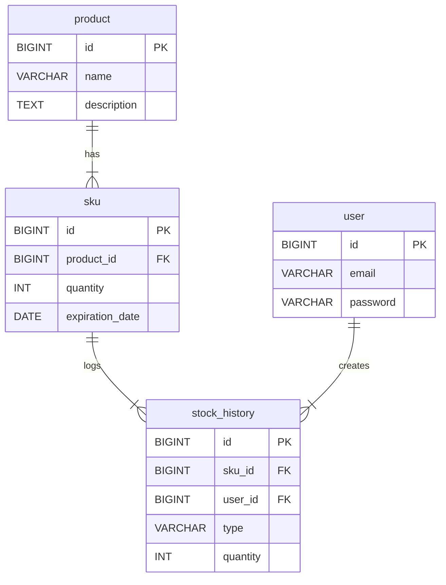

네, 알겠습니다. 프로젝트의 `README.md` 파일에 서비스 실행 방법과 Swagger UI 접속 방법을 포함하여 업데이트하겠습니다. 기존 `README.md` 내용에서 필요한 부분을 유지하고, 요청하신 내용을
중심으로 명확하게 정리했습니다.

-----

## 📖 README.md

### 프로젝트 설명

이 프로젝트는 NestJS, TypeORM, MySQL을 사용하여 구현한 재고 관리 시스템 API입니다.

### 주요 기능

- JWT 기반 사용자 인증 (회원가입, 로그인)
- 제품 등록 및 관리
- 재고 입출고 관리 (FEFO 원칙 적용)
- 재고 및 입출고 내역 조회

-----

### ⚙️ 설치 및 실행 방법

**1. `.env` 파일 생성**

프로젝트를 실행하기 전, 루트 디렉터리에 `.env` 파일을 생성해야 합니다. 아래는 `.env` 파일의 예시이며, 필요에 따라 값을 수정하여 사용해 주세요.

```env
# Database Credentials
DB_HOST=mysql
DB_PORT=3306
DB_USERNAME=root
DB_PASSWORD=your_mysql_root_password # docker-compose.yml의 MYSQL_ROOT_PASSWORD와 동일해야 합니다.
DB_DATABASE=denode_db

# JWT Secret
JWT_SECRET=your_secret_key_for_jwt
```

**2. Docker Compose를 이용한 애플리케이션 실행**

프로젝트 루트 디렉터리에서 아래 명령어를 실행하여 Docker 컨테이너를 빌드하고 실행합니다.

```bash
# -d 옵션으로 백그라운드에서 실행합니다.
# Docker Compose V2 (권장)
docker compose up --build -d

# Docker Compose V1 (구 버전)
docker-compose up --build -d
```

애플리케이션은 `http://localhost:3000` 에서 실행됩니다.

-----

네, 알겠습니다. `README.md` 파일에 데이터베이스 관계도와 `Product`와 `SKU`를 분리한 설계 이유에 대한 설명을 추가하겠습니다. 이 내용은 프로젝트의 구조를 이해하는 데 매우 중요합니다.

---

### `README.md` 추가 제안

기존 `README.md` 파일의 적절한 위치(예: "API 문서" 섹션 앞)에 아래 내용을 추가하시면 됩니다.

### 💾 데이터베이스 설계 (Database Design)

본 프로젝트의 데이터베이스는 제품의 메타 정보와 실제 재고 단위를 명확하게 분리하여 관리의 유연성과 확장성을 확보하는 데 중점을 두었습니다.

#### Entity Relationship Diagram (ERD)



#### 테이블 설명

- **`user`**: 회원가입한 사용자의 정보를 저장하는 테이블입니다.
- **`product`**: 제품의 이름, 설명과 같이 변하지 않는 고유 정보를 담는 마스터 테이블입니다.
- **`sku` (Stock Keeping Unit)**: 실제 재고를 관리하는 가장 작은 단위입니다. 특정 `product`에 속하며, 유통기한별로 재고 수량을 추적합니다.
- **`stock_history`**: 모든 재고(SKU)의 입고 및 출고 이력을 기록하는 로그 테이블입니다.

#### 설계 결정: `Product`와 `SKU`를 분리한 이유

"제품"과 "재고"를 하나의 테이블로 관리할 수도 있지만, `Product`와 `SKU`로 분리한 이유는 재고 관리 시스템의 핵심 요구사항을 더 명확하고 유연하게 처리하기 위함입니다.

- **개념적 분리**
    - **`Product`**: '어떤 상품인가?'에 대한 정의입니다. (예: "코카콜라 355ml")
    - **`SKU`**: '그래서 그 상품이 몇 개 있고, 어떤 특징을 가지는가?'에 대한 실체입니다. (예: "유통기한이 2025년 12월 31일인 코카콜라 355ml 100개")

- **설계의 장점**
    1. **세분화된 재고 추적**: 이 구조 덕분에 동일한 제품이라도 **유통기한별로 재고를 따로 관리**할 수 있습니다. 이는 재고 관리의 핵심 원칙인 **FEFO(First-Expired,
       First-Out, 선입선출)**를 구현하는 기반이 됩니다. 유통기한이 없는 제품은 `expiration_date`를 `NULL`로 두어 함께 관리할 수 있습니다.
    2. **유연성과 확장성**: 만약 나중에 제품의 '매입 가격'이나 '보관 창고' 등 SKU 단위로 추적해야 할 속성이 추가되더라도, `Product` 테이블을 건드리지 않고 `SKU` 테이블만 확장하면
       됩니다.
    3. **데이터 무결성 및 정규화**: 제품의 메타 정보(이름, 설명 등)는 `Product` 테이블에 한 번만 저장되므로 데이터 중복이 발생하지 않습니다. 재고량처럼 변경이 잦은 데이터는 `SKU` 테이블에
       격리되어 있어 시스템의 복잡도가 낮아지고 관리가 용이해집니다.

---

### 📄 API 문서 (Swagger UI)

애플리케이션이 실행되면, 아래 주소에서 API 문서를 확인하고 직접 테스트해볼 수 있습니다.

- **Swagger UI 주소**: [http://localhost:3000/api](https://www.google.com/search?q=http://localhost:3000/api)

Swagger 우측 상단의 `Authorize` 버튼을 클릭하고, 로그인 API를 통해 발급받은 `accessToken`을 복사해서 넣으시면 인증이 필요한 API를 테스트할 수 있습니다.

-----

### 🧪 테스트

프로젝트의 테스트를 실행하려면 아래 명령어를 사용하세요.

```bash
# 단위 테스트 (Unit Tests)
$ npm run test

# E2E 테스트 (End-to-End Tests)
# 주의: test:e2e 실행 시 .env.test 파일이 필요할 수 있습니다.
$ npm run test:e2e

```

-----
