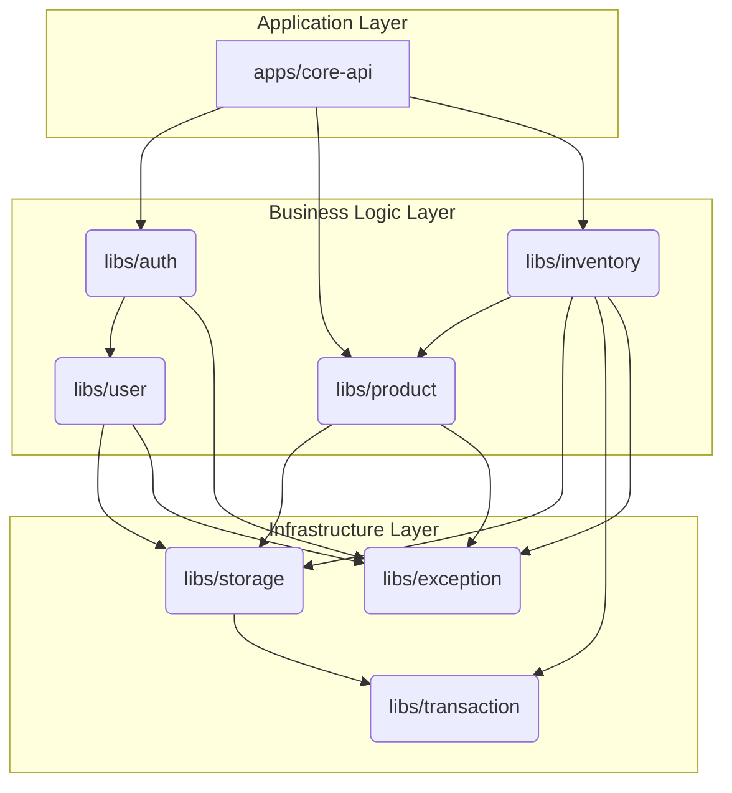
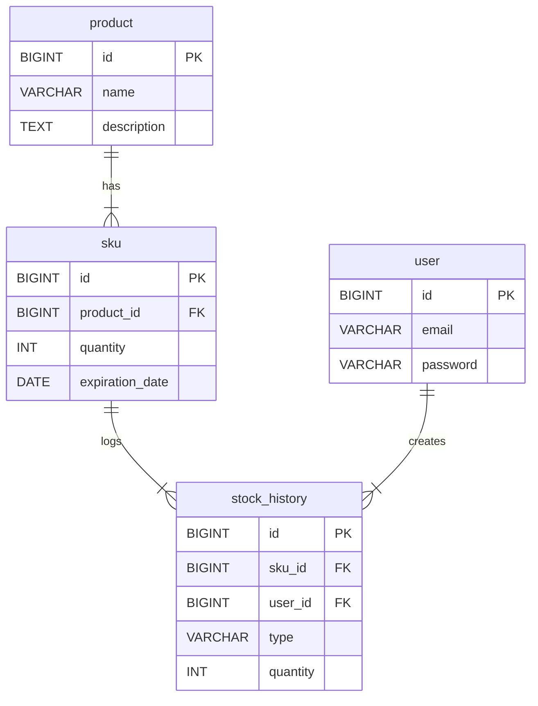

## 📖 README.md

### 목차

1. [주요 기능](#주요-기능)
2. [기술 스택](#기술-스택)
3. [시스템 아키텍처](#시스템-아키텍처)
4. [데이터베이스 설계](#데이터베이스-설계)
5. [핵심 기능 구현 전략](#핵심-기능-구현-전략)
6. [실행 및 테스트 방법](#실행-및-테스트-방법)
7. [API 문서 (Swagger UI)](#api-문서-swagger-ui)

### ✨주요 기능

- JWT 기반 사용자 인증 (회원가입, 로그인)
- 제품 등록 및 관리
- 재고 입출고 관리 (FEFO 원칙 적용)
- 재고 및 입출고 내역 조회

-----

### 🛠️기술 스택

- Framework: NestJS
- Language: TypeScript
- ORM: TypeORM
- Database: MySQL
- API Documentation: Swagger
- Testing: Jest, Supertest
- Containerization: Docker, Docker Compose

-----

### 💻시스템 아키텍처

본 프로젝트는 유지보수성, 테스트 용이성, 확장성을 핵심 목표로 계층형 아키텍처(Layered Architecture) 와 도메인 주도 설계(DDD)를 자체 컨벤션으로 사용했습니다.

#### 아키텍처 원칙

- 도메인과 인프라의 분리: libs/inventory/src/domain과 같이 순수한 비즈니스 규칙과 데이터를 담는 도메인 계층과, libs/storage처럼 데이터베이스 연동, 외부 API 호출 등 기술적인
  세부사항을 다루는 인프라 계층을 명확히 분리했습니다. 이를 통해 비즈니스 로직이 특정 DB 기술(TypeORM, MySQL)에 종속되지 않도록 했습니다.


- 의존성 역전 원칙 (DIP): 상위 계층(도메인)이 하위 계층(인프라)에 직접 의존하지 않고, 추상화된 인터페이스에 의존하도록 설계했습니다. 예를 들어, InventoryService는
  SkuOrmRepository라는 구체적인 클래스가 아닌, SKU_REPOSITORY라는 추상화된 토큰(인터페이스)에 의존합니다.

#### 모듈 구조 및 의존성

NestJS 모노레포 구조를 활용하여 기능별 모듈을 분리하고, 모든 의존성은 외부(apps/core-api)에서 내부(비즈니스 로직), 그리고 인프라(libs/storage)로 향하는 단방향으로 흐르도록 제어하여
순환 참조를 방지했습니다.



---

### 💾데이터베이스 설계

본 프로젝트의 데이터베이스는 제품의 메타 정보와 실제 재고 단위를 명확하게 분리하여 관리의 유연성과 확장성을 확보하는 데 중점을 두었습니다.

#### Entity Relationship Diagram (ERD)



#### 테이블 설명

- **`user`**: 회원가입한 사용자의 정보를 저장하는 테이블입니다.
- **`product`**: 제품의 이름, 설명과 같이 변하지 않는 고유 정보를 담는 마스터 테이블입니다.
- **`sku` (Stock Keeping Unit)**: 실제 재고를 관리하는 가장 작은 단위입니다. 특정 `product`에 속하며, 유통기한별로 재고 수량을 추적합니다.
- **`stock_history`**: 모든 재고(SKU)의 입고 및 출고 이력을 기록하는 로그 테이블입니다.

#### 설계 결정: `Product`와 `SKU`를 분리한 이유

"제품"과 "재고"를 하나의 테이블로 관리할 수도 있지만, `Product`와 `SKU`로 분리한 이유는 재고 관리 시스템의 핵심 요구사항을 더 명확하고 유연하게 처리하기 위함입니다.

- **개념적 분리**
    - **`Product`**: '어떤 상품인가?'에 대한 정의입니다. (예: "초코에몽 190ml * 5개입")
    - **`SKU`**: '그래서 그 상품이 몇 개 있고, 어떤 특징을 가지는가?'에 대한 실체입니다. (예: "유통기한이 2025년 12월 31일인 초코에몽 190ml 100개")

- **설계의 장점**
    1. **세분화된 재고 추적**: 이 구조 덕분에 동일한 제품이라도 **유통기한별로 재고를 따로 관리**할 수 있습니다. 이는 재고 관리의 핵심 원칙인 **FEFO(First-Expired,
       First-Out, 선입선출)**를 구현하는 기반이 됩니다. 유통기한이 없는 제품은 `expiration_date`를 `NULL`로 두어 함께 관리할 수 있습니다.
    2. **유연성과 확장성**: 만약 나중에 제품의 '매입 가격'이나 '보관 창고' 등 SKU 단위로 추적해야 할 속성이 추가되더라도, `Product` 테이블을 건드리지 않고 `SKU` 테이블만 확장하면
       됩니다.
    3. **데이터 무결성 및 정규화**: 제품의 메타 정보(이름, 설명 등)는 `Product` 테이블에 한 번만 저장되므로 데이터 중복이 발생하지 않습니다. 재고량처럼 변경이 잦은 데이터는 `SKU` 테이블에
       격리되어 있어 시스템의 복잡도가 낮아지고 관리가 용이해집니다.

---

### 🦾핵심 기능 구현 전략

#### 동시성 제어: 비관적 락 (Pessimistic Lock)

- 문제: 재고가 10개 남은 상품에 대해 두 사용자가 동시에 7개씩 출고 요청 시, 데이터 정합성이 깨져 재고가 음수가 될 수 있는 **Race Condition**이 발생할 수 있습니다.


- 해결: 이 문제를 해결하기 위해 비관적 락과 트랜잭션 격리 수준 조정을 고려했습니다.
    1. SERIALIZABLE 격리 수준은 가장 강력하지만, 필요 이상의 넓은 범위에 락을 걸어 성능 저하 및 데드락 가능성이 큽니다.
    2. **비관적 락 SELECT ... FOR UPDATE**은 문제가 되는 특정 레코드(row)만 정밀하게 잠글 수 있습니다.


- 선택: 비관적 락을 최종 선택했습니다. 특정 재고에 대한 경합이 예상되는 '읽기-수정-쓰기' 시나리오에서, 성능 손실을 최소화하면서 데이터 정합성을 완벽하게 보장하는 가장 적합한 해결책이라고 판단했습니다.
  이 로직은 skuRepository.findForUpdateByProductId 메소드에 명시적으로 구현되어 있습니다.

#### 예외 처리

- CustomException: 모든 비즈니스 예외가 상속받는 추상 클래스를 두어 errorCode, httpStatus를 갖도록 강제했습니다.<br />
  InsufficientStockException처럼 이름만으로 의도를 알 수 있는 구체적인 예외를 사용하여 코드 가독성을 높였습니다.


- GlobalExceptionFilter: 모든 예외를 중앙에서 처리하며, 5xx 에러는 error로, 4xx 비즈니스 예외는 warn 레벨로 로깅을 분리하여 효과적인 모니터링이 가능하도록 구현했습니다.

---

### 🚀실행 및 테스트 방법

#### 사전 준비

- Docker 및 Docker Compose 설치
- 프로젝트 루트 디렉터리에 .env 파일 생성 (아래 내용 참고)

```env
# Database Credentials
DB_HOST=mysql
DB_PORT=3306
DB_USERNAME=root
DB_PASSWORD=your_mysql_root_password # docker-compose.yml의 MYSQL_ROOT_PASSWORD와 동일해야 합니다.
DB_DATABASE=denode_db

# JWT Secret
JWT_SECRET=your_secret_key_for_jwt
```

#### Docker Compose를 이용한 애플리케이션 실행

프로젝트 루트 디렉터리에서 아래 명령어를 실행하여 Docker 컨테이너를 빌드하고 실행합니다.

```bash
# -d 옵션으로 백그라운드에서 실행합니다.
# Docker Compose V2 (권장)
docker compose up --build -d

# Docker Compose V1 (구 버전)
docker-compose up --build -d
```

애플리케이션은 `http://localhost:3000` 에서 실행됩니다.

#### 테스트

```bash
# Docker Compose V2 (권장)
# 단위 테스트 실행
docker compose exec app npm run test

# E2E 테스트 실행
docker compose exec app npm run test:e2e

# Docker Compose V1 (구 버전)
# 단위 테스트 실행
 docker-compose exec app npm run test
 
# E2E 테스트 실행
 docker-compose exec app npm run test:e2e
```

-----

### 📄API 문서 (Swagger UI)

애플리케이션이 실행되면, 아래 주소에서 API 문서를 확인하고 직접 테스트해볼 수 있습니다.

- **Swagger UI 주소**: [http://localhost:3000/api](https://www.google.com/search?q=http://localhost:3000/api)

Swagger 우측 상단의 `Authorize` 버튼을 클릭하고, 로그인 API를 통해 발급받은 `accessToken`을 복사해서 넣으시면 인증이 필요한 API를 테스트할 수 있습니다.

-----
